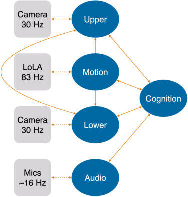

# BHuman

{:.info}
This section will trace the flow of BHuman Robot Control code.

Basic Concepts: Modules and Representations[¶](https://docs.b-human.de/coderelease2023/architecture/modules-representations/#modules-and-representations)

# Architecture

The BHuman robot is controlled by six threads `Upper`, `Lower`, `Cognition`, `Motion`, `Audio`, and `Debug`

- `Upper`, `Lower`: Image processing threads, they use the images received by it eyes to build robot’s perception of the world. It use a couple of neural network to extract different information form image.
- `Cognition`: The high level control thread. Generally, it receive processed information from `Upper`, `Lower` thread and send high level control signal to `Motion` thread
- `Motion`: The low level joint control. Including step planning, calibration, and etc. This thread directly send signals to LoLA.
- `Audio`: Hear the whistle; Use the speaker to say something …
- `Debug`: Communicate with computer, receive debug signals …

Information flow:

## Cognition Thread

Cognition thread module graph

### Module View Interpretation [¶](https://docs.b-human.de/coderelease2023/simrobot/#module-views)

Since all the information about the current module configuration can be requested from the robot control program, it is possible to generate a visual representation automatically. The graphs, such as the one that is shown above, are generated by the program *dot* from the *Graphviz* package[**4**](https://docs.b-human.de/coderelease2023/simrobot/#fn:EmdenEtAl2000). Modules are displayed as yellow rectangles and representations are shown as blue ellipses. Representations that are received from another thread are displayed in orange and have a dashed border. If they are missing completely due to a wrong module configuration or because they are alias representations, both label and border are displayed in red. There is a module view per thread.

The module graph can be zoomed in or out by using the *mouse wheel*, touch gestures, or the *page up/down* buttons. It can also be dragged around with the left mouse button or by touch gestures.

### Control Flow in Cognition

This diagram is construct by tracing the function call stack, it’s also highly recommended to trace the execution of the code by yourself