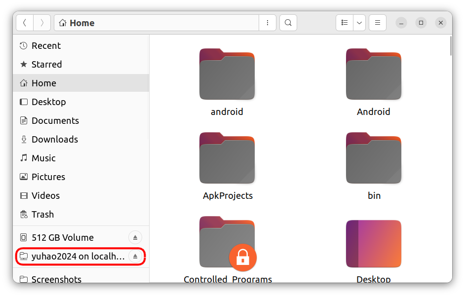
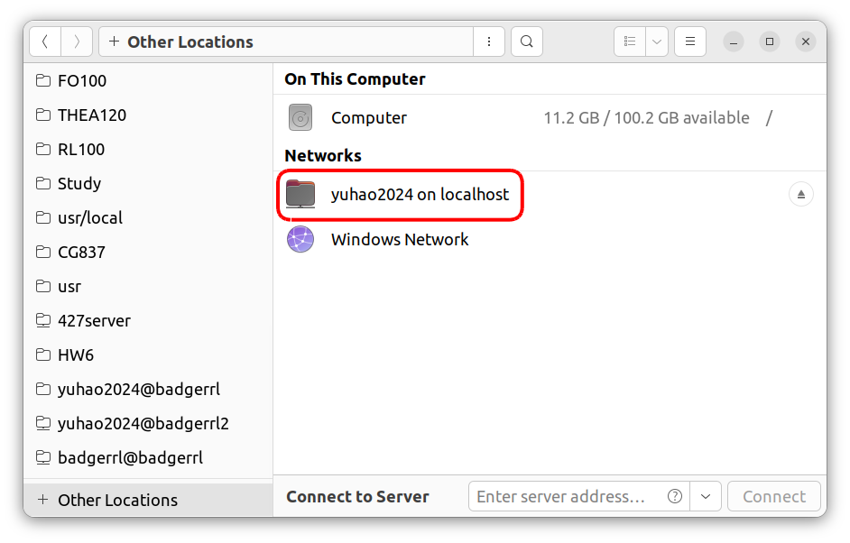

<details open markdown="block">
  <summary>
    Table of contents
  </summary>
  {: .text-delta }
1. TOC
{:toc}
</details>

# Lab Server

# Usage

## Connect

 For people new to this lab

1. In the very first place, please ensure you have contact an administer to create your account.
2. For Windows user, it’s highly recommended to use WSL2 and use Linux environment
3. Connect Script is highly recommended
4. The `<XXX>` in the following document are placeholders, please replace them as a whole, including the `<>`

### Connect Script

[connect-badgerrl.sh](https://github.com/Badger-RL/LabServerScripts/blob/main/ClientScripts/connect-badgerrl.sh)

### Dependencies

- **WSL1** (Not supported yet)
  ```bash
  sudo apt install nautilus remmina tmux expect bc
  ```
  Possible work around:[Start GUI on WSL1](https://medium.com/actived/how-to-start-gui-on-wsl-1-2-on-windows-11-10-8-7-62f1ae1c00fd)
- **Linux** / **WSL2**
  <a id = "wsl2-dependencies"></a>
  ```bash
  sudo apt install nautilus remmina tmux expect net-tools bc
  ```
- **OSX**
  https://brew.sh/

  ```bash
  # Install brew
  /bin/bash -c "$(curl -fsSL https://raw.githubusercontent.com/Homebrew/install/HEAD/install.sh)"
  ```

  ```bash
  # Install other packages
  # Recommended
  brew install tmux
  # Optional (for mounting remote folder)
  brew install --cask macfuse
  brew install gromgit/fuse/sshfs
  ```

  ⚠️ For OSX (MacOS) Users
  Apple tighten their system plugin restriction in their recent OSX release, you can either

  1. Ignore this feature
  2. Follow this tutorial to enable system plugin

     - Enable system plugin

       1. Click the Apple menu and choose Shut Down.
       2. Press and hold the power button on your Mac until you see Loading Startup Options.
       3. Choose Options, then click Continue.

          {: .responsive-graph-medium}

       4. Select your startup disk, then click Next.
       5. Type in your administrator password and click Continue.
       6. Click Utilities in the menu bar and choose Startup Security Utility.

          {: .responsive-graph-medium}

       7. Select your boot disk and click Security Policy.

          {: .responsive-graph-medium}

       8. Select the button next to Reduced Security.

          You can only select the first option (Allow user management of kernel extensions from identified developers)

          {: .responsive-graph-medium}

       9. Select the box next to Allow user management of kernel extensions from identified developers.
       10. Click OK.
       11. Click the user pop-up menu and choose your administrator account. Then type in the password and click OK.
       12. Click the Apple menu and choose Restart.

### Configuration

Modify config variables in the script

- Highly recommended for everyone
  - `default_duo_device`
  - `default_remote_username`
    Your account on lab server (e.g. alice2024)
  - `default_remote_server_name`
    Our lab computer doesn’t share storage, so it’s likely you prefer to work on one machine
    Just flip a coin and pick badgerrl or badgerrl2
- If you prefer a specific ssh key
  - `default_ssh_key`
    Switch to your preferred key, for example `id_ed25519`. Don’t include the path or the `.pub` surfix
    Currently it doesn’t support keys outside your `~/.ssh` folder
    PS: You can specify a non-existing key, the script will create it for you. If you also specify a password, it will use the password to encrypt the key
- If you want a stable port to forward the sftp
  - `default_sftp_port`
    e.g. 6099 (pick one that won’t conflict with other service on your computer)
    If left to default, it will be picked randomly
- If you are really lazy
  - `cs_password`
    The password of you CS account, used for automated Duo login
  - `default_key_password`
    The ssh key password

### Connect CLI (SSH)

General case

```bash
./ssh-badgerrl -t -u yuhao2024 -s badgerrl -p XXXXX -d 1
```

- `-t`: ssh tunnel mode

- `-u`: lab computer username (e.g. yuhao2024)

- `-s`: lab computer hostname (server name)

- `-p`: CS password

- `-d`: Duo device
- **First Time login with pre-existing key**

  [Write id_rsa key to server video.mp4](./Trial1.mp4)

  - `-k`: name of the existing key
  - `-w`: write key to server. just like ssh-copy-id

- **First Time login with a new key**

  - `-k`: name of the new key
  - `--key-password`: the password used to encrypt the key (optional)
  - `-w`: write key to server. Not visible in the video but automatically enabled when you create a new key

  [Generate rllab_key and write to server video.mp4](./Trial.mp4)

  You also need to specify the key and password in all login afterwards

### Result

A tmux pseudo terminal will take control after running the command

{: .responsive-graph-medium}

### Connect File System

```bash
./ssh-badgerrl -m -u yuhao2024 -s badgerrl -p XXXXX -d 1
```

- `-m`: sftp mount mode

### Result

- OSX
  A `XXXMountPoint` folder will appear under you home folder, your **home folder** on remote machine will be mount there
  As the linux symbolic link doesn’t work with this kind of mount, the **Shared** folder is mounted separately

  [Successful mount video](<./Trial2_(1).mp4>)

- Linux
  Your home folder on remote machine will appear on the side bar of nautilus (the file browser)

  {: .responsive-graph-medium}

  Or you can find it under `Other Locations -> Networks`

  {: .responsive-graph-medium}

### Connect GUI (VNC)

⚠️ VNC is intended to be used exclusively with the physical screen

There would be a conflict between physical screen login in and VNC server login in.

Before starting a vncserver, ensure you logout from the physical screen

The following sample is on Linux OS

1.  First, [ssh](..md) into your remote account
    <br>
    {: .responsive-graph-medium}
    {: .responsive-graph-medium}
2.  Run `Shared/start_vnc_server.sh`
    <br>
    {: .responsive-graph-medium}
3.  Watch the port the server is running on
    In the previous example it is **5960**
4.  Exit the remote ssh shell
    <a id="vnc-initial-password"></a>
    ⚠️ The first time you run the script, it will show you the default VNC password (should be badgerrl) and the way to change it. Please remember, VNC password is an **independent** password
    <br>
    {: .responsive-graph-medium}
    {: .responsive-graph-medium}
5.  Create a new ssh connection to forward the port, both `-t` and `-m` option should work
    <br>

    1.  **`-t`**
        <br>
        {: .responsive-graph-medium}

            After connection is established, **keep the terminal open**

    2.  **`-m`**
        <br>
        {: .responsive-graph-medium}

        You can safely close the terminal

6.  [Optional] Check connect status

    - Linux/WSL2

      ```bash
      netstat -tuln | grep <port_number (e.g.5960)>
      ```

      {: .responsive-graph-medium}

    - OSX
      ```bash
      netstat
      ```

7.  Connect with vnc client

    - TigerVNC Client (All Platform)

      {: .responsive-graph-medium}

      {: .responsive-graph-medium}

      The password is the [**VNC password**](#vnc-initial-password) you see / you set on the lab server

      {: .responsive-graph-medium}

    - Remmina (Linux/WSL2)
      Run `remmina` on command line

      {: .responsive-graph-medium}
      {: .responsive-graph-medium}

      Afterwards you can connect with one click

### VNC Client recommendation

- **TigerVNC Client**
  Minimum Lightweight VNC Client, no need to install
  ⚠️ Latest version (>1.12) might report:

  > An unexpected error occurred when communicating with the server:
  >
  > No matching security types
  >
  > Attempt to reconnect?
  > Solution: use stable version

  [TigerVNC - Browse /stable/1.12.0 at SourceForge.net](https://sourceforge.net/projects/tigervnc/files/stable/1.12.0/)

- **Remmina**
  Powerful VNC/RDP/SFTP Client preinstalled in most Linux distro
  Need [manual installation](#wsl2-dependencies) on WSL

  {: .responsive-graph-medium}

  {: .responsive-graph-medium}

### Sample Usage

- **OSX**
  The video is too large, view it in [this link](https://drive.google.com/file/d/1qO7QZ3zcXnnJEN6g3RvYCnZ-Me8rR1AK/view?usp=drive_link)

<a id="wsl2-vedio"> </a>

- **WSL2**

  [WSL2 Demo video.mp4](https://drive.google.com/file/d/1UQOcTw-M_0nQEF_VPGwxBVyhZ8tOG4ng/view?usp=drive_link)

- **Linux**
  Linux Connection is the same as [**WSL2**](#wsl2-vedio)

### Connect With VSCode

⚠️ VScode is nice, but we met many problems when trying to connect to lab server though vscode

Updated: Oct 6 2024

1. **Windows:**

   **SSH connection doesn’t work**

   Problem: Cannot install vscode-server extension

   - Use Tunneling:

     [Windows VScode tunnel connection video.mp4](./Kazam_screencast_00036.mp4)

2. MacOS (OSX):

   1. **Latest version of vscode**

      SSH/Tunneling both works fine

      SSH: **BE AS FAST AS YOU CAN WHEN LOGGING IN** (Password + Duo)

   2. **Old version of VScode** (indicated by No Tunneling functionality / Only have SSH option)

      > Ben buy a new computer, Currently nobody is in this situation

      Currently there’s **no way to connect to the lab server**

      Problems:

      1. Infinite login prompt
      2. Cannot install extension

3. **Linux (Ubuntu)**

   SSH/Tunneling both works fine

   SSH: **BE AS FAST AS YOU CAN WHEN LOGGING IN** (Password + Duo)

## Net structure

<a id="wisc-net"></a>

### 🏛 WISC Net

[WISC VPN](https://it.wisc.edu/services/wiscvpn/) brings you here

<a id="cs-net"></a>

#### 🌐 CS Department Net

[CS Department VPN](https://csl.cs.wisc.edu/docs/csl/2019-11-14-globalprotect-department-vpn/) bring you here (Only professor have it)

- **CS Lab machines**

  You can login to these machines at [`best-linux.cs.wisc.edu`](http://best-linux.cs.wisc.edu) from [WISC Net](#wisc-net) [**through ssh**](#ssh-command-target) with you [**CS account and password**](https://apps.cs.wisc.edu/accountapp/). It’s the only way to bring you into [CS Department Net](#cs-net).

  <a id="ssh-command-target"></a>ssh target: `<NetID>@best-linux.cs.wisc.edu`

- **badgerrl** at `128.105.102.51`

  Your account name should be:
  <your_first_name(all lower case)><year_you_join_the_lab>
  e.g. firstname2024 for name: “FirstName LastName”

  - **SPL_WISC (Robot Lab Net)**

    Nao Robots `nao@10.0.52.<robot number>`

- **badgerrl2** at `128.105.102.54`

# Setup OS and environment

🔑 This section is for administers only

## Setup Script

[setup.sh](https://github.com/Badger-RL/LabServerScripts/blob/main/ServerScripts/setup.sh)

Simply runs it and it will prompt for each change it make. If @Yuhao Li is still in the Lab, please contact him

### OS

[Ubuntu 22.04.5 LTS (Jammy Jellyfish)](https://releases.ubuntu.com/jammy/)
